# DATASET EXPLANATION ON MARVEL CHARACTERS

## Program developed by :

         Yuvadarshini S (212221230126)
         Mirudhula D (212221230060)
         Dharshini D S (212221230022)


## BIG DATA ANALYTICS:


         This article utilizes statistical methods, data mining techniques and Python in order to create a prediction model for superhero characters alignment.

         Starting off we choose what dataset to utilize — which is then prepared, handled and analyzed. 
         
         Then, the cleansed data is imported to create a viable prediction model that can foretell the alignment based on descriptions of the characters. 
         
         This outcome is then tested and debated to describe the different results.
         
## Program:
```
import pandas as pd
import numpy as np
import seaborn as sns

df=pd.read_csv("MarvelMovies.csv")
df

df.head()

df.info()

df.isnull()

df.isnull().sum()

df['FIRST APPEARANCE']=df['FIRST APPEARANCE'].fillna(df['GENDER'].mode()[0])
df['GENDER']=df['GENDER'].fillna(df['GENDER'].mode()[0])
df['ALIGN']=df['ALIGN'].fillna(df['GENDER'].mode()[0])

df['YEAR']=df['YEAR'].fillna(df['APPEARANCES'].mean())
df['APPEARANCES']=df['APPEARANCES'].fillna(df['APPEARANCES'].mean())
df.head()

df['YEAR']=df['YEAR'].fillna(df['YEAR'].median())

df.info()

df.head()

df.shape()

df.describe()

df.tail()

df.columns

df.duplicated()

df.dtypes

df['APPEARANCES'].value_counts()

sns.boxplot(x="APPEARANCES",data=df)

sns.countplot(x='ID',data=df)


sns.distplot(df["YEAR"])

sns.scatterplot(df['APPEARANCES'],df['HAIR'])


plt.xticks(rotation = 90)
sns.barplot(df['GENDER'],df['YEAR'],hue=df['ALIVE'])


states=df.loc[:,["HAIR","YEAR"]]
states=states.groupby(by=["HAIR"]).sum().sort_values(by="YEAR")
#plt.figure(figsize=(10,7))
sns.barplot(x=states.index,y="YEAR",data=states)
plt.xticks(rotation = 90)
plt.xlabel=("APPEARANCES")
plt.ylabel=("COUNT")
plt.show()

import matplotlib.pyplot as plt
plt.plot(df.YEAR, df.APPEARANCES)

sns.countplot(x="HAIR",data=df)
plt.xticks(rotation = 90)
plt.legend(loc=1)

plt.xticks(rotation = 90)
sns.barplot(x="ALIGN",y="APPEARANCES",data=df)
plt.xticks(rotation = 90)


df1=df.groupby(by=["ALIGN"]).sum()
labels=[]
for i in df1.index:
    labels.append(i)
colors=sns.color_palette("bright")
plt.pie(df1["APPEARANCES"],labels=labels,autopct="%0.0f%%")
plt.show()

df.corr()
plt.subplots(figsize=(12,7))
sns.heatmap(df.corr(),annot=True)

sns.histplot(data=df,x ='ALIVE',hue='ALIGN')

sns.kdeplot(x="Year", data = df,hue='ALIVE')
```
## Output:

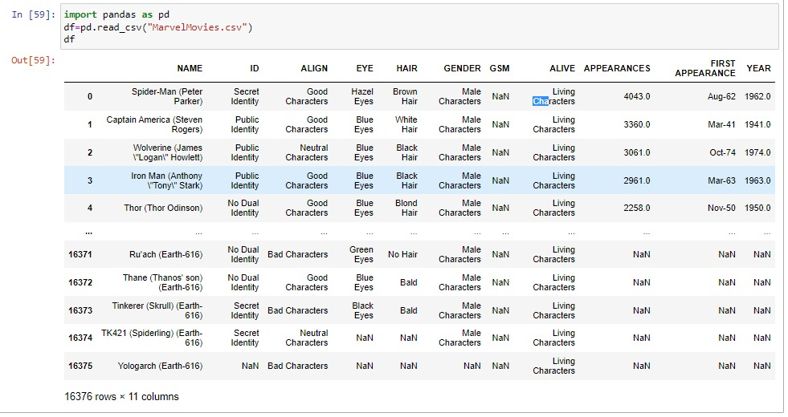
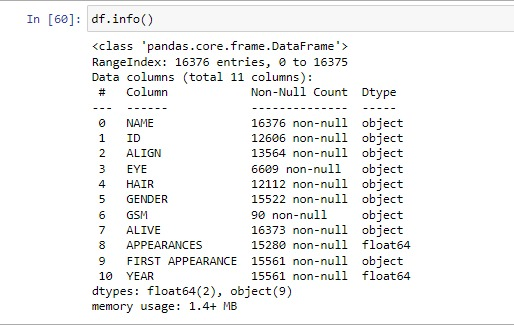
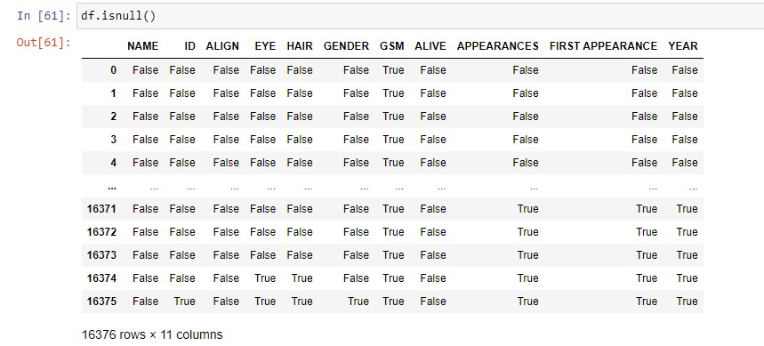
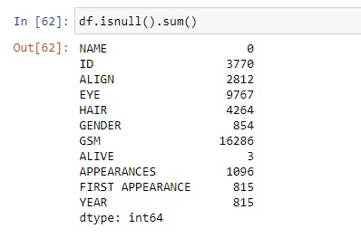
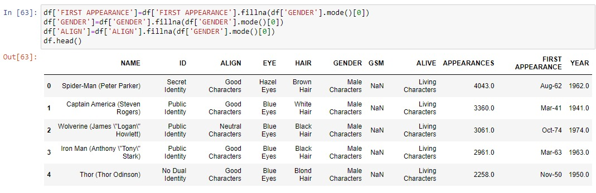
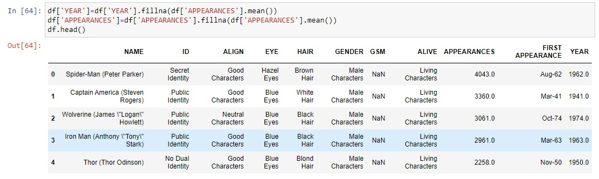
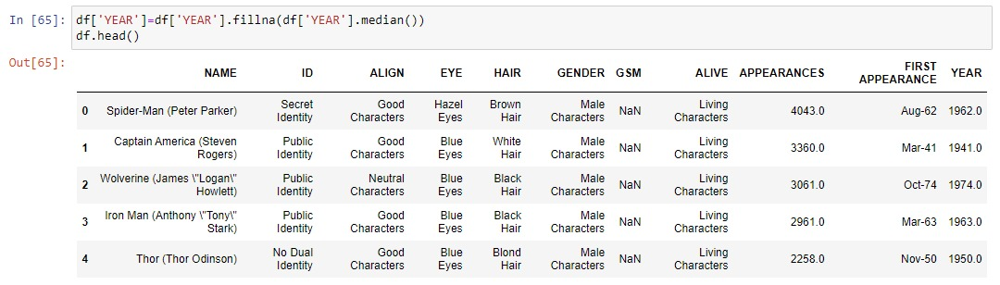
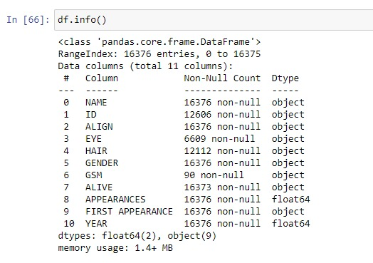
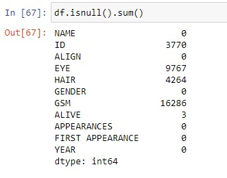
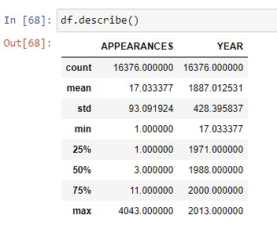
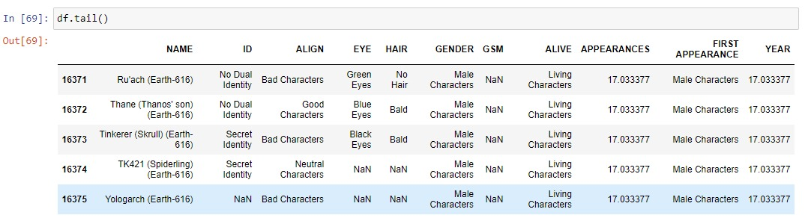
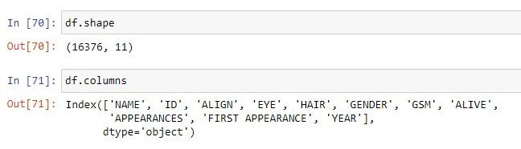
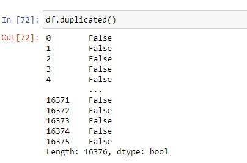
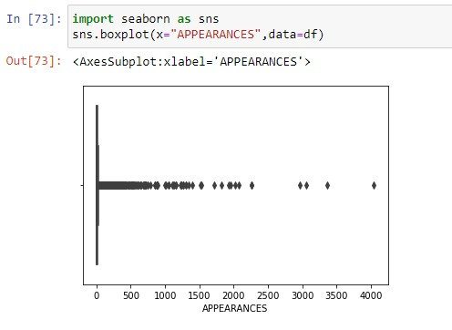
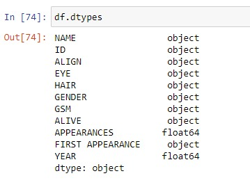
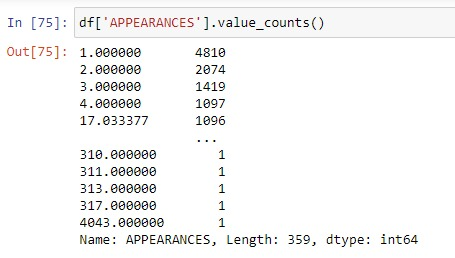
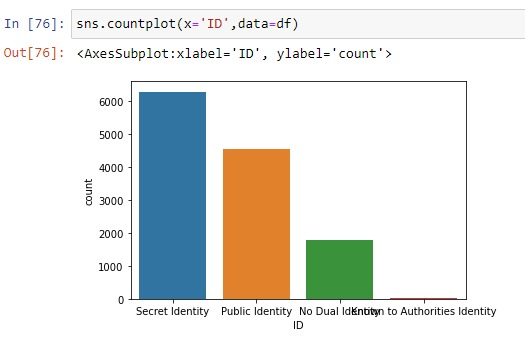
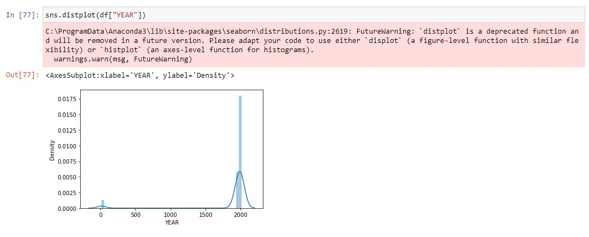
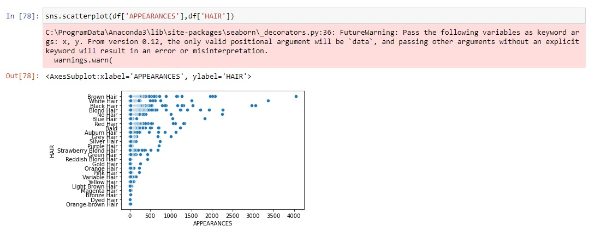
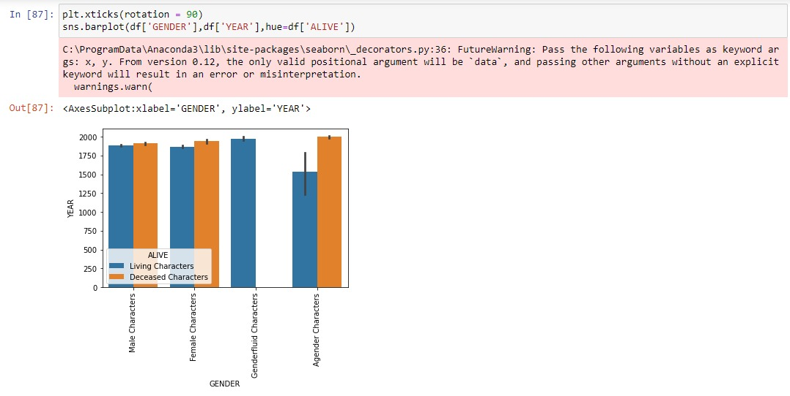
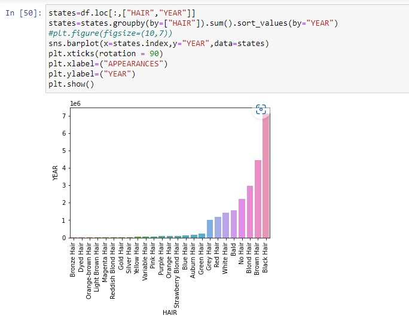
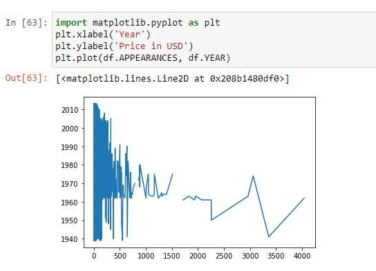
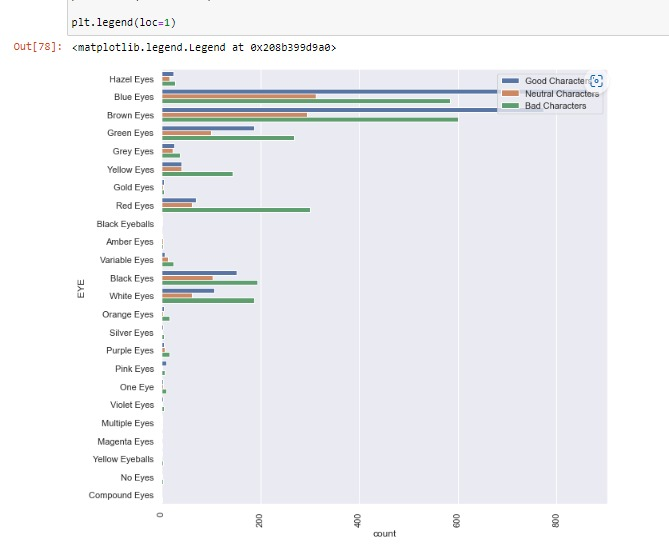
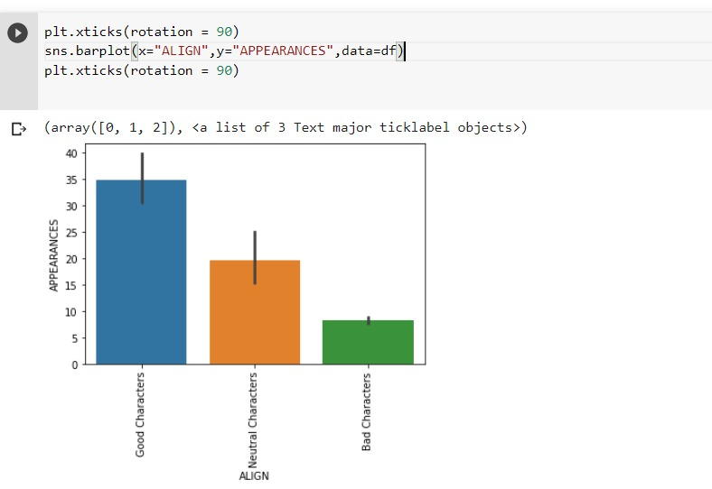
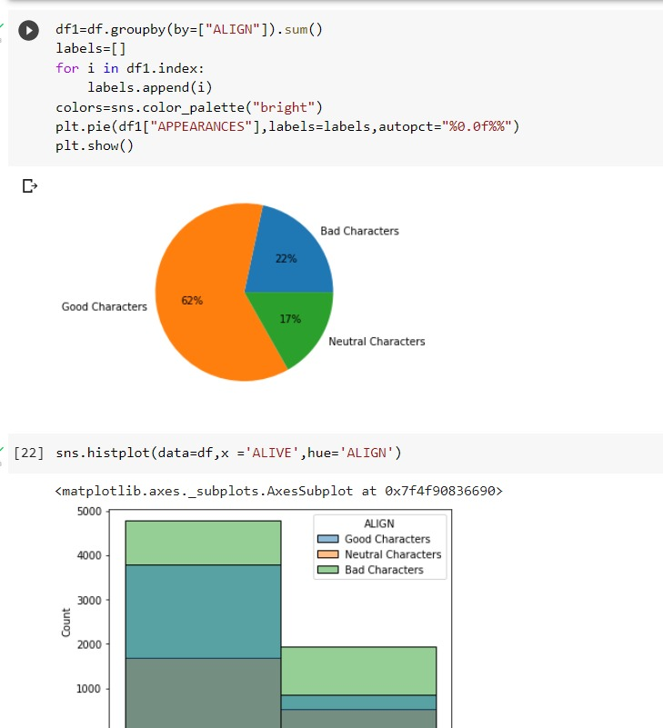
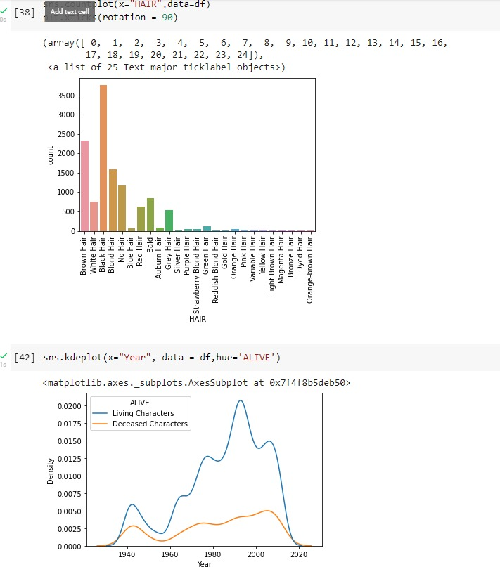
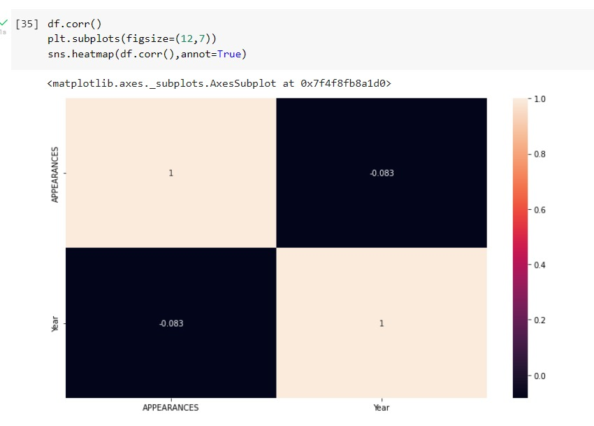

## Conclusion:
Data science is employed in many spheres of human life. 
The value of the algorithms and their efficiency can hardly be underestimated.
The use of data science in the field of media and entertainment has become an art.
It is no longer enough just to spread news, rumors or offer entertaining activities.
A company should reach the interaction with a customer, evoke feelings and emotions and make a desirable impact. 
The ability of data science to collect, process, analyze, store, provide recommendations is a huge benefit for the media and the entertainers.

